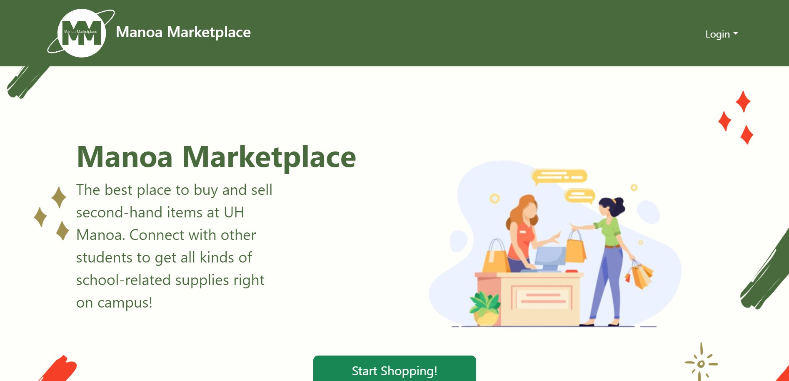
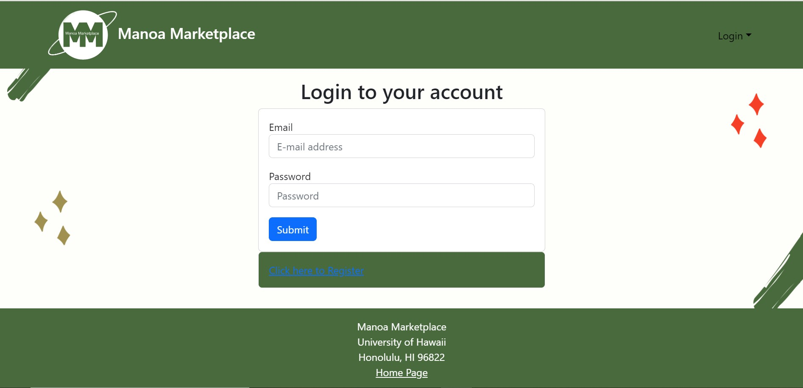
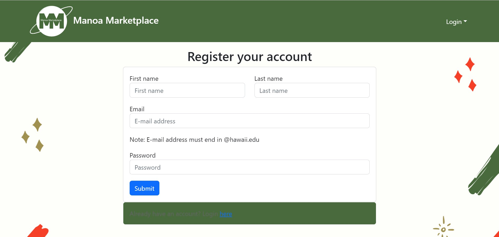
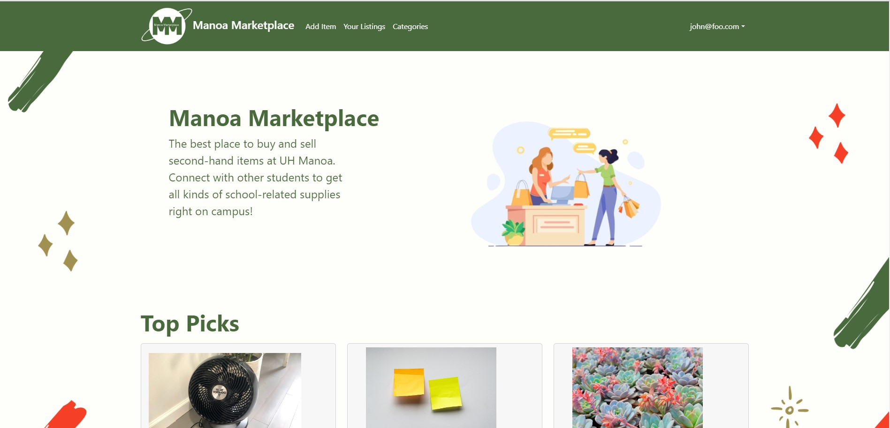
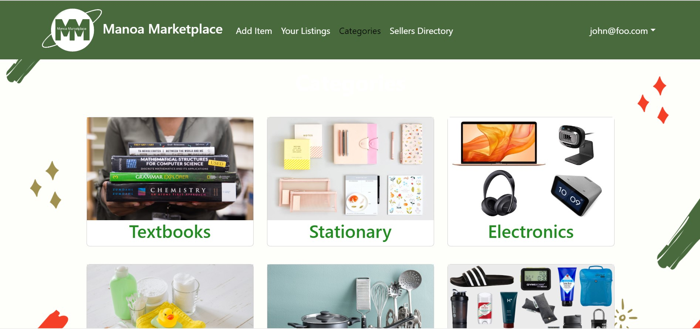
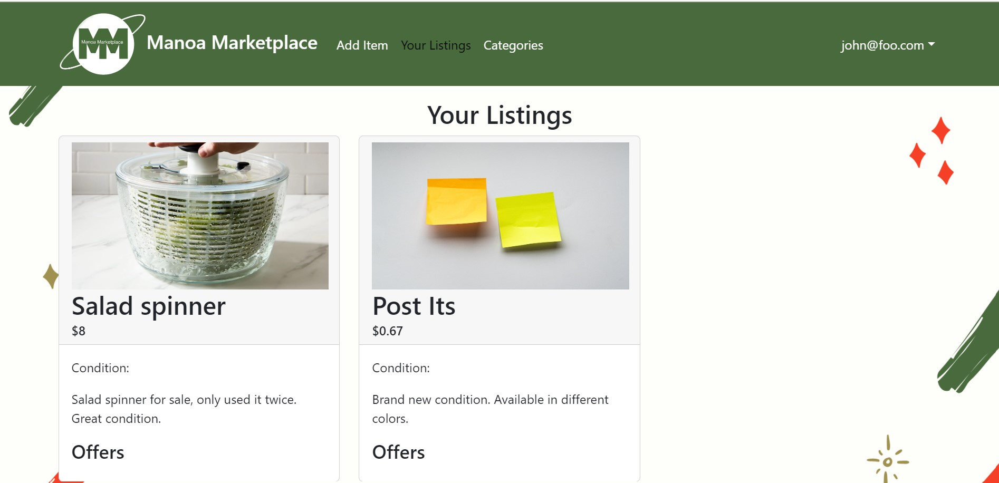
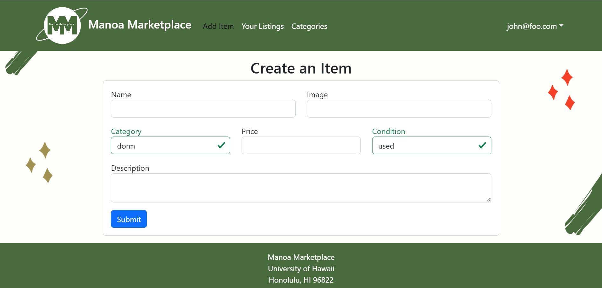

# Manoa Marketplace

[GitHub Organization](https://github.com/manoamarketplace)

[Team Contract](https://docs.google.com/document/d/1ZQ-Apqbr8ef9pxsUrwbN6swEVVe1EIwGtawZnpmVP_w/edit?usp=sharing)

[Deployed Application](https://manoa-marketplace.site/)

### Overview:

Manoa Marketplace is a web application that provides a safe and simple way for students to buy and sell items on campus, giving students a chance to recycle and reuse campus-specific goods. Tools used in the web application are listed below.

* [Meteor](https://www.meteor.com/) for Javascript-based implementation of client and server code.
* [React](https://reactjs.org/) for component-based UI implementation and routing.
* [React Bootstrap](https://react-bootstrap.github.io/) CSS Framework for UI design.
* [Uniforms](https://uniforms.tools/) for React and Semantic UI-based form design and display.

Manoa Marketplace allows UH students, faculty, or staff to buy and sell items. There is no anonymity: buyers and sellers connect through their UH credentials.
Transactions are expected to occur on-campus. Because buyers and sellers are from UHM, the goods and services will be relevant to UH students.

### Project goals:

* Students can search for goods they are looking to buy
* Students can list goods for sale
* Students can make offers on items and contact one another
* Admins can monitor site activity and report inappropriate behavior

### Mockup pages:
* Landing page
    * The landing page is the home page and the first page users will land on when they visit the top-level URL to the website.



* Sign-in and sign-up page
  * The sign in and sign up page is where the students can create an account to search for goods and list goods for sale.




* User home page
  * The user page is the page where the students will first see once logged in.



* Admin home page
  * The admin home page is where users with the “admin” role will have access. These could be UH Mānoa staff and faculty.
* Categories page
  * The categories page is where users can filter and find specific categories to search for items.



* Items listed page
  * The items listed page is where all listed items in the following category are shown.
 
 
 
* Create item page
  * The list item page is where the students can post items for sale. Items can be categorized, have a starting price point, and will include the date listed.



* Make offer on item page
  * Students are allowed to make offers on specific items, almost like a bid.
* Notify admin page
  * This page allows users to notify admins and report users in the case of post scams, explicit users, and bad behavior.

## Developer Guide

This section provides information of interest to Meteor developers wishing to use this code base as a basis for their own development tasks.

### Installation

First, [install Meteor](https://www.meteor.com/install).

Second, visit the [Manoa Marketplace application github page](https://github.com/manoamarketplace/manoamarketplace), and click the "Clone or download" button to create your own repository initialized with a copy of this application. Alternatively, you can download the sources as a zip file or make a fork of the repo.  However you do it, download a copy of the repo to your local computer.

Third, cd into the manoamarketplace/app directory and install libraries with:

```
$ meteor npm install
```

Fourth, run the system with:

```
$ meteor npm run start
```

If all goes well, the application will appear at [http://localhost:3000](http://localhost:3000).

### Application Design

Manoa Marketplace is based upon [meteor-application-template-react](https://ics-software-engineering.github.io/meteor-application-template-react/) and [meteor-example-form-react](https://ics-software-engineering.github.io/meteor-example-form-react/). Please use the videos and documentation at those sites to better acquaint yourself with the basic application design and form processing in Maroa Marketplace.

### Milestone 1: Mockup Pages and Collections Development

The goal of Milestone 1 is to create the basic layout and mockup pages and collections. The structure and design of the website are also modified here.

Milestone 1 was managed using [Manoa Marketplace GitHub Project Board M1](https://github.com/orgs/manoamarketplace/projects/1)

### Milestone 2: Provide functionality e.g. clickable links, allow users to add items, register accounts, etc.

The goal of Milestone 2 is to provide functionality so that users are able to utilize the website. For example, in this stage, they'll be able to add and edit their respective listings as well as view the listings of others. They'll also be able to make offers on items that they are interested in purchasing.

Milestone 2 was managed using [Manoa Marketplace GitHub Project Board M2](https://github.com/orgs/manoamarketplace/projects/3)

### Milestone 3: Provide additional functionality and improve user experience

The goal of Milestone 3 is to provide additional functionality so that the overall user experience can be improved. Additional features include a rating system and search bar. Additional elements will also be added to the admin side.

Milestone 3 was managed using [Manoa Marketplace GitHub Project Board M3](https://github.com/orgs/manoamarketplace/projects/6/views/1)

### Team
Manoa Marketplace is built by Jazmin Lor, Alyssa Greenwell, Russ Flores, Jing Zheng

