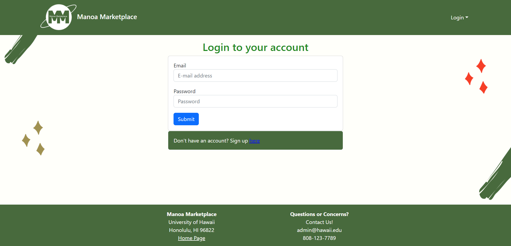
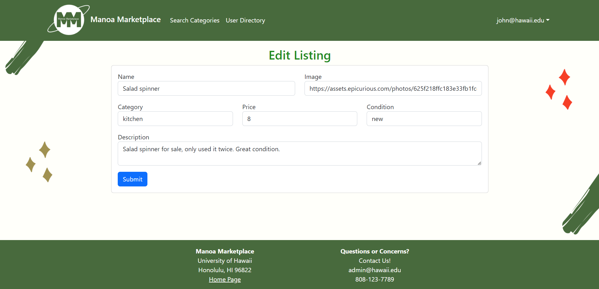
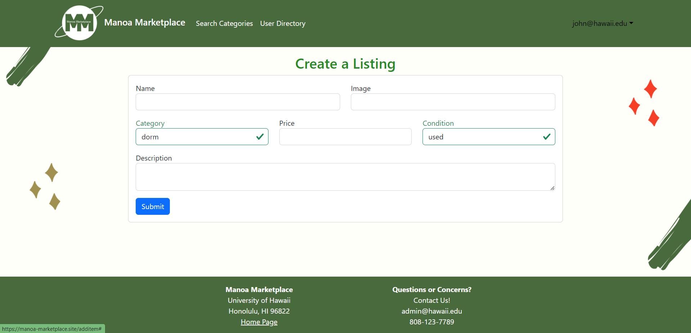
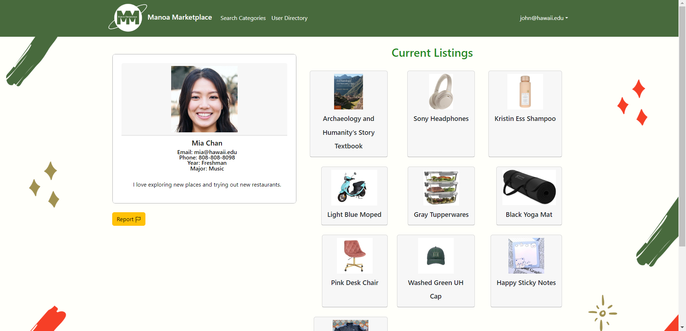

# Manoa Marketplace

[GitHub Organization](https://github.com/manoamarketplace)

[Team Contract](https://docs.google.com/document/d/1ZQ-Apqbr8ef9pxsUrwbN6swEVVe1EIwGtawZnpmVP_w/edit?usp=sharing)

[Deployed Application](https://manoa-marketplace.site/)

### Overview:

Manoa Marketplace is a web application that provides a safe and simple way for students to buy and sell items on campus, giving students a chance to recycle and reuse campus-specific goods. Tools used in the web application are listed below.

* [Meteor](https://www.meteor.com/) for Javascript-based implementation of client and server code.
* [React](https://reactjs.org/) for component-based UI implementation and routing.
* [React Bootstrap](https://react-bootstrap.github.io/) CSS Framework for UI design.
* [Uniforms](https://uniforms.tools/) for React and Semantic UI-based form design and display.

Manoa Marketplace allows UH students, faculty, or staff to buy and sell items. There is no anonymity: buyers and sellers connect through their UH credentials.
Transactions are expected to occur on-campus. Because buyers and sellers are from UHM, the goods and services will be relevant to UH students.

### Project goals:

* Students can search for goods they are looking to buy
* Students can list goods for sale
* Students can make offers on items and contact one another
* Admins can monitor site activity and report inappropriate behavior

### User Guide:
* Landing page
    * The landing page is the home page and the first page users will land on when they visit the top-level URL to the website.


* Sign-in and sign-up page
  * The sign in and sign up page is where the students can create an account to search for goods and list goods for sale.




* User home page
  * The user page is the page where the students will first see once logged in.


* Categories page
  * The categories page is where users can filter and find specific categories to search for items.


* Items listed page
  * The items listed page is where all listed items in the following category are shown.
  * This is an example page of when you click on the category "Stationary".


* More Info page
    * Clicking on an item will direct you to a page with more information.


 
 * Your Listings page
  * The "Your Listings" page is where all listed items created by the user are shown.


* Owner's More Info page
  * Similar to the regular More Info page, if a seller looks at their own listing from the "Your Listings" they will get a page that allows them access to edit and delete their listing, as well as see what people are interested in buying.


* Edit Item page
  * The edit item page allows users to edit their existing listings.


 
* Create item page
  * The list item page is where the students can post items for sale. Items can be categorized, have a starting price point, and will include the date listed.



* Sellers Directory page
  * This page allows users to look at different sellers and their profile.


* Notify admin page
  * This page allows users to notify admins and report users in the case of post scams, explicit users, and bad behavior.


* Create your profile page
   * Once users sign up, they are immediately redirected to this page to create their profile.


* View your profile page
   * If users click on the user's email on the Navbar, users can view their profile here.
   * There is also a link to edit their profile from their Profile page.



* Edit your profile page
   * Once the link is clicked on to edit their profile, users are redirected to this page.
   * Users may edit their information.


### Developer Guide:

This section provides information of interest to Meteor developers wishing to use this code base as a basis for their own development tasks.

#### Installation

First, [install Meteor](https://www.meteor.com/install).

Second, visit the [Manoa Marketplace application github page](https://github.com/manoamarketplace/manoamarketplace), and click the "Clone or download" button to create your own repository initialized with a copy of this application. Alternatively, you can download the sources as a zip file or make a fork of the repo.  However you do it, download a copy of the repo to your local computer.

Third, cd into the manoamarketplace/app directory and install libraries with:

```
$ meteor npm install
```

Fourth, run the system with:

```
$ meteor npm run start
```

If all goes well, the application will appear at [http://localhost:3000](http://localhost:3000).

#### Application Design

Manoa Marketplace is based upon [meteor-application-template-react](https://ics-software-engineering.github.io/meteor-application-template-react/) and [meteor-example-form-react](https://ics-software-engineering.github.io/meteor-example-form-react/). Please use the videos and documentation at those sites to better acquaint yourself with the basic application design and form processing in Manoa Marketplace.

### Continuous Integration

[](https://github.com/manoamarketplace/manoamarketplace/actions/workflows/ci.yml/)

Manoa Marketplace has GitHub Actions to automatically run ESLint and TestCafe each time a commit is made to the "main" branch.

### Community Feedback

This page has been tested by members of the UH Manoa community. The following is a summary of their thoughts and feedback on the application:

**Justin** - “The website design is minimalistic and each page is free of distractions. The flow as users browse through the site feels smooth. I would recommend having the ‘reported’ items be temporarily removed from listing pending admin review. There should also be a messaging capability added so that users and sellers alike can get in touch with each other.”

**Gianna** - “The general idea of creating a marketplace is great and definitely helpful. You could alphabetize the majors on the create profile page and add more majors as well. You could create subcategories like in the clothing category you could add women, men, children clothing.”

**Clifford** - “I would use a site like this to sell a lot of my dorm stuff like my mini fridge, so it makes a lot of sense to have something like this. That said I would like to be sure that the listings are monitored and I’m not getting scammed, so I would like to see something that shows that items or users have been verified."

**Mia** - “The graphics are visually pleasing, and the page has a really nice modern vibe to it. I would like to see more on the home page though. I’m a frequent online shopper and I think the ability to scroll and see categories and items right off the bat is really nice from a user's perspective."

**Zech** - “I really like the website for its simplicity and neatness. Makes everything easy to use and I can see a lot of UH students and staff using it. However, I would like to see more user data and perhaps a more secure login, such as a requirement for the password.”


### Milestone 1: Mockup Pages and Collections Development

The goal of Milestone 1 is to create the basic layout and mockup pages and collections. The structure and design of the website are also modified here.

Milestone 1 was managed using [Manoa Marketplace GitHub Project Board M1](https://github.com/orgs/manoamarketplace/projects/1)

### Milestone 2: Provide functionality e.g. clickable links, allow users to add items, register accounts, etc.

The goal of Milestone 2 is to provide functionality so that users are able to utilize the website. For example, in this stage, they'll be able to add and edit their respective listings as well as view the listings of others. They'll also be able to make offers on items that they are interested in purchasing.

Milestone 2 was managed using [Manoa Marketplace GitHub Project Board M2](https://github.com/orgs/manoamarketplace/projects/3)

### Milestone 3: Provide additional functionality and improve user experience

The goal of Milestone 3 is to provide additional functionality so that the overall user experience can be improved. Additional features include a rating system and search bar. Additional elements will also be added to the admin side.

Milestone 3 was managed using [Manoa Marketplace GitHub Project Board M3](https://github.com/orgs/manoamarketplace/projects/6/views/1)

### Team
Manoa Marketplace is built by [Jazmin Lor](https://jazminlor.github.io/), [Alyssa Greenwell](https://alyssa-greenwell.github.io/), [Russ Flores](https://selene-flores.github.io/), [Jing Zheng](https://jingtzheng.github.io/)

